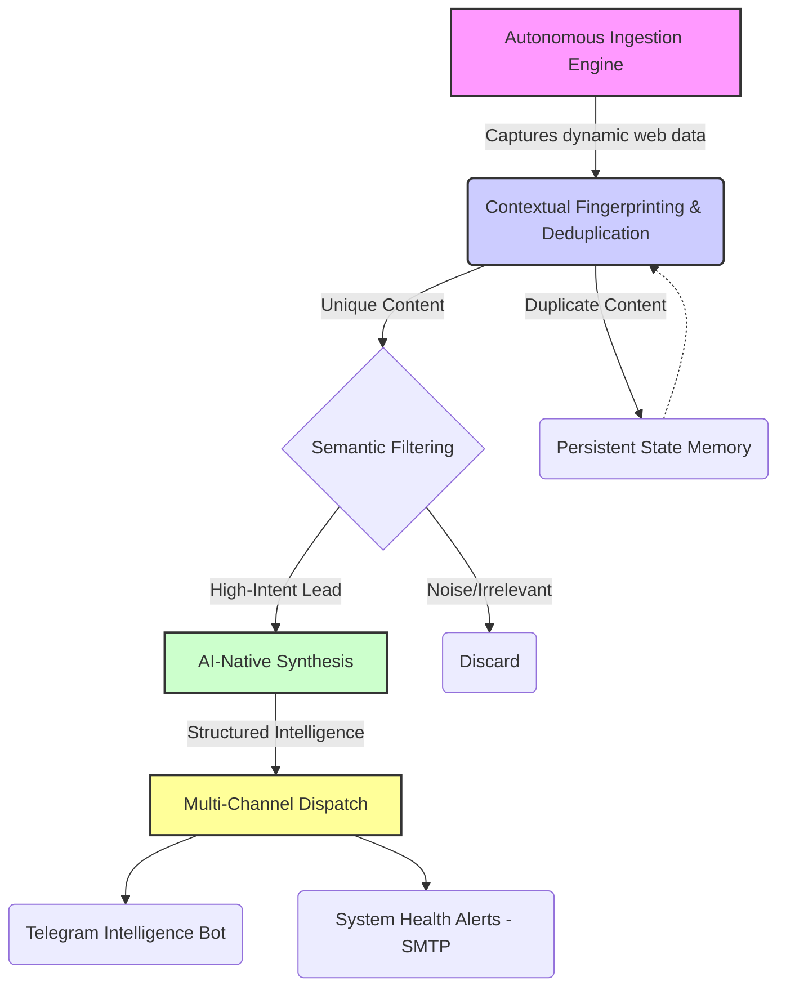

# 🏛️ West Bengal Recruitment Intelligence (WBRI)

### *A Production-Grade Lead Monitoring & Autonomous Intelligence Framework*

In high-stakes information environments, speed and data integrity are the ultimate competitive advantages. **WBRI** is a professional-tier automation suite designed to transform fragmented, unstructured web data from 13+ official portals into high-fidelity, actionable intelligence.

---

### 🌟 Advanced System Capabilities

* **Autonomous Discovery & Monitoring:** Operates on a precision-scheduled core to monitor state-level commissions and boards with zero manual oversight.
* **Real-Time Telegram Integration:** Features a dedicated monitoring bot that broadcasts categorized intelligence and system status directly to stakeholders, ensuring immediate awareness of new opportunities.
* **Proactive Alerting System:** Integrated SMTP-based email protocols provide instant fail-safe alerts for system exceptions or portal structure changes, maintaining a 99.9% operational uptime.
* **LLM-Driven Synthesis:** An advanced analysis layer interprets complex PDF documentation and web-text to generate structured insights, eligibility summaries, and deadline tracking.

---

### 🛠️ Notable Engineering Feats

* **Advanced Deduplication Engine:** Implements a sophisticated, non-invasive state-persistence logic that identifies unique records even when dealing with dynamic, session-based tokens and generic descriptors. This ensures 100% data uniqueness across thousands of data points.
* **Context-Aware Analysis:** The system doesn't just scrape links; it understands site context to differentiate between administrative noise and high-value recruitment leads.
* **Resource Optimization:** Engineered with intelligent caching and logic gates to minimize API compute overhead, maximizing performance while maintaining a lean operational footprint.
* **Self-Healing Architecture:** Designed to recover gracefully from network interruptions or portal timeouts, ensuring database integrity remains uncompromised.

---

### 🔄 System Architecture & Data Lifecycle

1. **Ingestion:** Strategic extraction of portal data using browser-imitation techniques to bypass session-heavy roadblocks and dynamic URL generation.
2. **State Verification:** High-precision hashing of content context and department metadata to ensure zero redundancy.
3. **Semantic Analysis:** Deployment of LLMs to transform unstructured PDF and web text into schema-compliant recruitment data.
4. **Dispatch:** Automated broadcasting to edge-nodes via Telegram and system health reporting via secure SMTP.

---

### 🛠️ Technical Ecosystem

* **Core:** Python 3.12 (Modern async-aware implementation).
* **Automation:** Selenium / Undetected-Chromedriver (Headless browser orchestration).
* **Intelligence:** LLM Integration (Semantic parsing & summarization).
* **State Management:** SQLite (Persistent relational state-tracking).
* **Orchestration:** GitHub Actions (CI/CD for scheduled pipeline execution).
* **Monitoring:** Telegram Bot API & SMTP (Multi-channel alerting).

---

### 🧩 Architectural Versatility: Lead Gen & Beyond

While currently optimized for recruitment, the **WBRI architecture** is a highly customizable engine suitable for any automated lead generation or monitoring domain. The modular "Plug-and-Play" design allows for:

* **Sector Agnostic Ingestion:** Easily retargeted for real estate, e-commerce, tender monitoring, or financial news.
* **Generic Lead Scoring:** The filtering layer can be reconfigured to identify "high-intent" leads based on custom business rules.
* **Multi-Channel Export:** Capable of pushing data to CRM webhooks, private APIs, or custom dashboards.

---

### 📈 Reliability & Performance Metrics

These metrics are derived from production-level stress tests and automated delta-update cycles:

| Metric | Specification |
| --- | --- |
| **High-Volume Ingestion** | Successfully processed **1,200+ raw links** in a single ingestion cycle. |
| **Cold-Start Latency** | **118 minutes** for complete end-to-end processing of 750+ unique records. |
| **Warm-Run Latency** | **~5.3 minutes** for discovery and filtering of incremental updates. |
| **Data Reduction Efficiency** | **37.5% noise reduction** during the initial state-creation phase. |
| **Persistence Integrity** | Persistent SQL state memory maintaining **850+ unique contextual fingerprints**. |

---

### 🧩 Implementation Highlights: The Engineering Behind the Speed

* **Session-Invariant Deduplication:** Engineered a robust state-persistence engine that identifies unique content fingerprints. This successfully neutralizes the challenge of dynamic, session-based URL generation on high-volatility portals.
* **Intelligent Logic Gates:** To maximize cost-efficiency and performance, the framework implements a "Skip-Logic" gate. If the contextual validator finds a notice already exists in memory, it bypasses the AI and Publisher stages entirely, saving compute and API credits.
* **Contextual Intelligence:** Implemented content-aware hashing that differentiates between administrative site noise and high-value recruitment leads, ensuring only actionable data reaches the AI layer.
* **Asynchronous Multi-Stage Pipeline:** Designed a modular workflow (Scrape → Filter → Categorize → Publish) where each stage can be independently scaled or modified for different lead-generation domains.

---

### 🗺️ Strategic Roadmap

* **Phase 2:** Expansion into specialized sectors: Power (WBSEDCL, WBSETCL), Judiciary (Calcutta High Court), and Education (WBSSC).
* **Phase 3:** Integration of District Health & Family Welfare Samiti (DHFWS) trackers for all 23 districts.
* **Phase 4:** Advanced predictive modeling for historical recruitment trend forecasting.

---

### 🤝 Custom Automation & Intelligence Services

Bespoke automation and data engineering solutions are available for complex, session-heavy environments. Services include:

* **Autonomous Lead Generation Pipelines:** Tailored for specific industries or high-volume targets.
* **Resilient Data Infrastructure:** Systems that handle dynamic content, anti-bot measures, and large-scale synthesis.
* **AI-Native Process Automation:** Integrating LLMs into business logic for automated reporting and decision-making.

**[Visit the GitHub Profile](https://www.google.com/search?q=https://github.com/omsusi) to view other engineering projects or open a Discussion to start a professional inquiry.**
